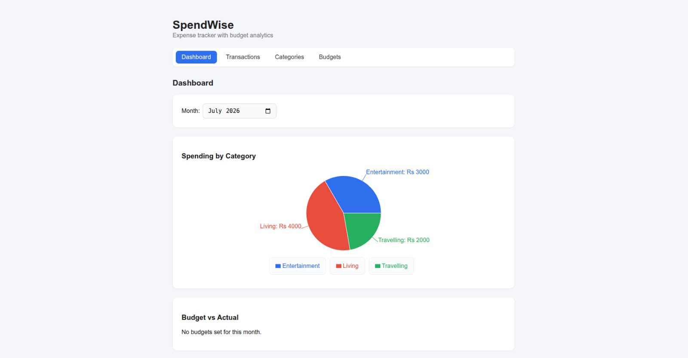
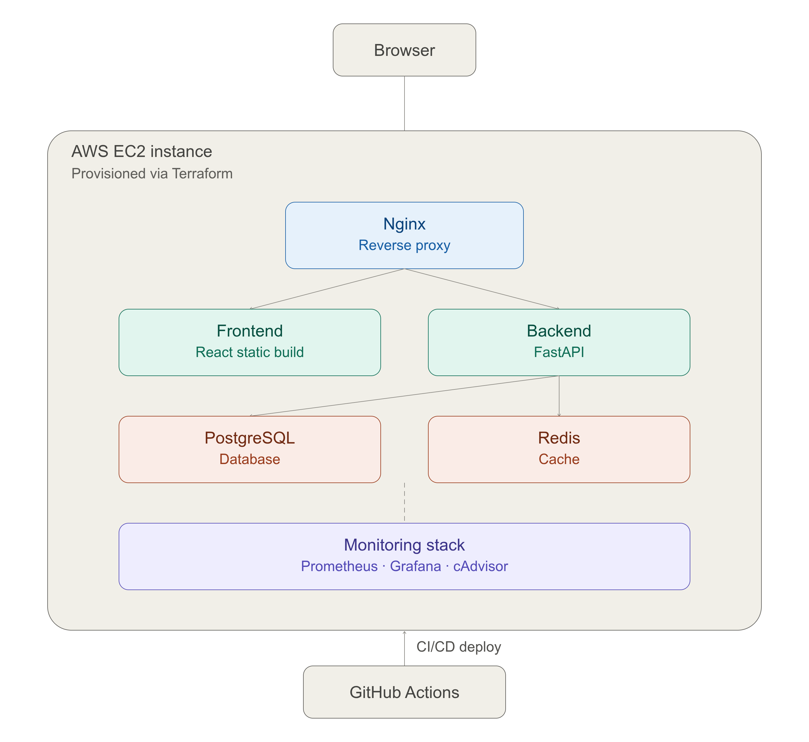
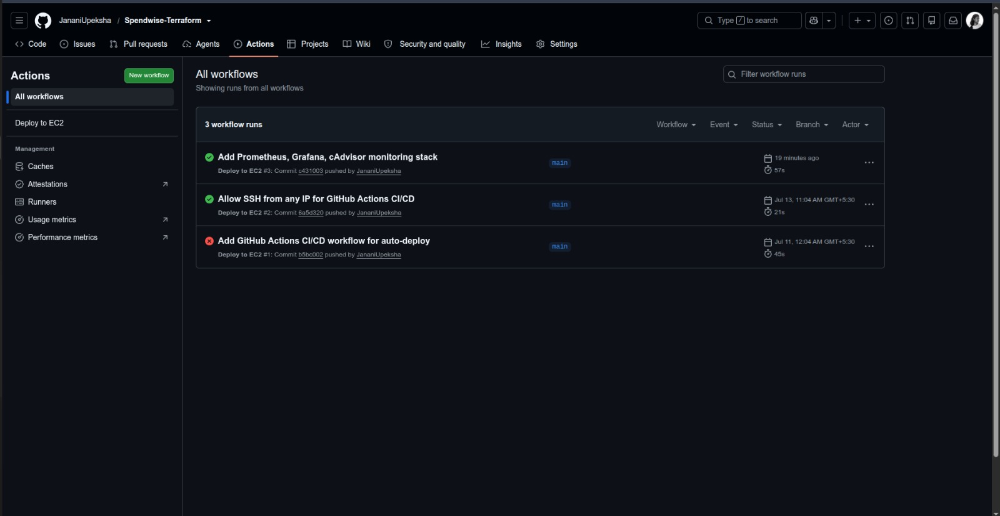
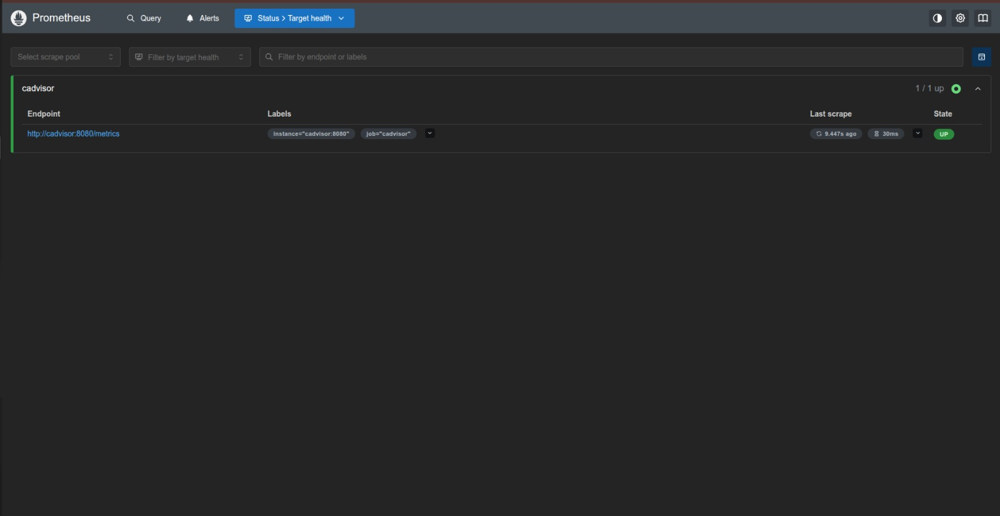
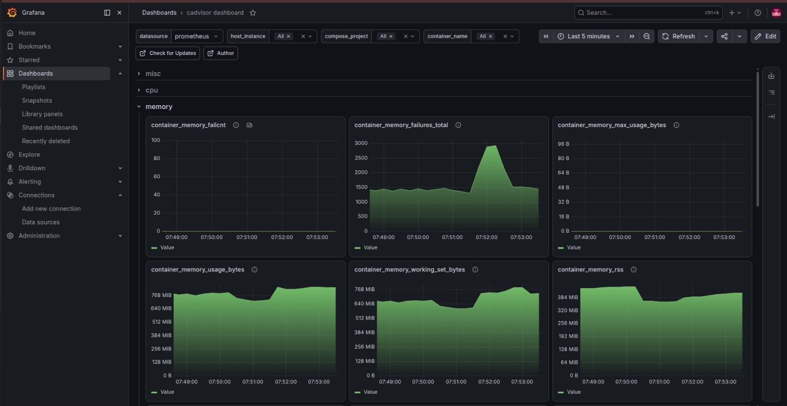

# 💰 SpendWise

A full-stack expense tracker with budget analytics, built as a hands-on DevOps portfolio project. This project covers the complete lifecycle of a modern application — from writing the backend and frontend, to containerizing it, deploying it on real cloud infrastructure, automating that deployment, and monitoring it in production.

🔗 **Live demo:** http://15.206.55.8

---

## ✨ Features

- 📊 **Dashboard** — visual analytics with spending by category, budget vs actual, and monthly trends
- 💸 **Transactions** — add, edit, and delete income/expense records with categories
- 🏷️ **Categories** — organize spending into custom categories
- 🎯 **Budgets** — set monthly spending limits per category
- ⚡ **Redis caching** — analytics queries are cached for speed, with automatic invalidation whenever transactions change

---

## 🛠️ Tech stack

| Layer | Technology |
|---|---|
| **Backend** | FastAPI, SQLAlchemy, Alembic, PostgreSQL, Redis |
| **Frontend** | React (Vite), React Router, Recharts, Axios |
| **Containerization** | Docker, Docker Compose, Nginx (reverse proxy) |
| **Infrastructure** | Terraform, AWS EC2, AWS IAM |
| **CI/CD** | GitHub Actions |
| **Monitoring** | Prometheus, Grafana, cAdvisor |

---

## 🏗️ Architecture overview

- **Nginx** is the single public entry point on the server, routing requests by path:
  - `/` → React frontend
  - `/api/` → FastAPI backend
  - `/grafana/` → Grafana dashboards
  - `/prometheus/` → Prometheus UI
- **Frontend** is built into static files and served by its own lightweight Nginx container (multi-stage Docker build)
- **Backend** connects to PostgreSQL for persistent storage and Redis for caching expensive analytics queries
- **Monitoring pipeline**: cAdvisor collects per-container resource stats → Prometheus scrapes and stores them on a schedule → Grafana visualizes them as live dashboards
- Only Nginx is exposed to the internet (`ports`); every other service uses Docker's internal `expose`, unreachable from outside the container network
- The entire stack runs as Docker containers on a single AWS EC2 instance (`t3.micro`, `ap-south-1`)

---

## 🌍 Infrastructure as Code

All AWS infrastructure — the EC2 instance, security group, SSH key pair, and Elastic IP — is defined as code in [`terraform/`](terraform/) instead of being manually clicked together in the AWS Console.

    cd terraform
    terraform init
    terraform plan
    terraform apply

This means the entire server environment can be destroyed and rebuilt identically in under a minute, from a handful of `.tf` files.

---

## 🔄 CI/CD

Every push to `main` triggers [`.github/workflows/deploy.yml`](.github/workflows/deploy.yml), which:

1. Connects to the EC2 instance over SSH (using a GitHub Actions secret)
2. Pulls the latest code (`git pull`)
3. Rebuilds and restarts the Docker containers (`docker compose up -d --build`)

No manual deployment steps required after merging to `main`.

---

## 📈 Monitoring

- **cAdvisor** exposes real-time resource metrics (CPU, memory, network) for every running container
- **Prometheus** scrapes those metrics every 15 seconds and stores them as time-series data
- **Grafana** queries Prometheus and renders live dashboards — accessible at `/grafana/`

### Prometheus — scrape target health

### Grafana — live container metrics

---

## 🚀 Running locally

    git clone https://github.com/JananiUpeksha/Spendwise-Terraform.git
    cd Spendwise-Terraform
    docker compose up -d --build
    docker exec -it spendwise_backend alembic upgrade head

The app will be available at `http://localhost`.

---

## 📁 Project structure

    ├── backend/              # FastAPI application
    │   ├── app/
    │   │   ├── routers/       # API endpoints (categories, transactions, budgets, analytics)
    │   │   ├── models/         # SQLAlchemy models
    │   │   ├── database.py
    │   │   └── cache.py         # Redis connection
    │   └── alembic/            # Database migrations
    ├── frontend/              # React application
    │   └── src/
    │       ├── pages/           # Dashboard, Transactions, Categories, Budgets
    │       ├── components/       # NavBar
    │       └── api/               # Axios client
    ├── terraform/             # Infrastructure as Code (EC2, security group, key pair, EIP)
    ├── docker-compose.yml      # Multi-container orchestration
    ├── nginx.conf               # Reverse proxy routing
    ├── prometheus.yml            # Metrics scrape configuration
    └── .github/workflows/         # CI/CD pipeline

---

## 📝 What this project demonstrates

- ✅ Full-stack development (FastAPI + React)
- ✅ Database design and migrations
- ✅ Caching strategy with invalidation
- ✅ Multi-stage Docker builds
- ✅ Docker Compose orchestration
- ✅ Reverse proxy configuration (Nginx)
- ✅ Cloud infrastructure provisioning (AWS EC2)
- ✅ Infrastructure as Code (Terraform)
- ✅ CI/CD automation (GitHub Actions)
- ✅ Production monitoring (Prometheus + Grafana + cAdvisor)

---

## 📄 License

MIT
